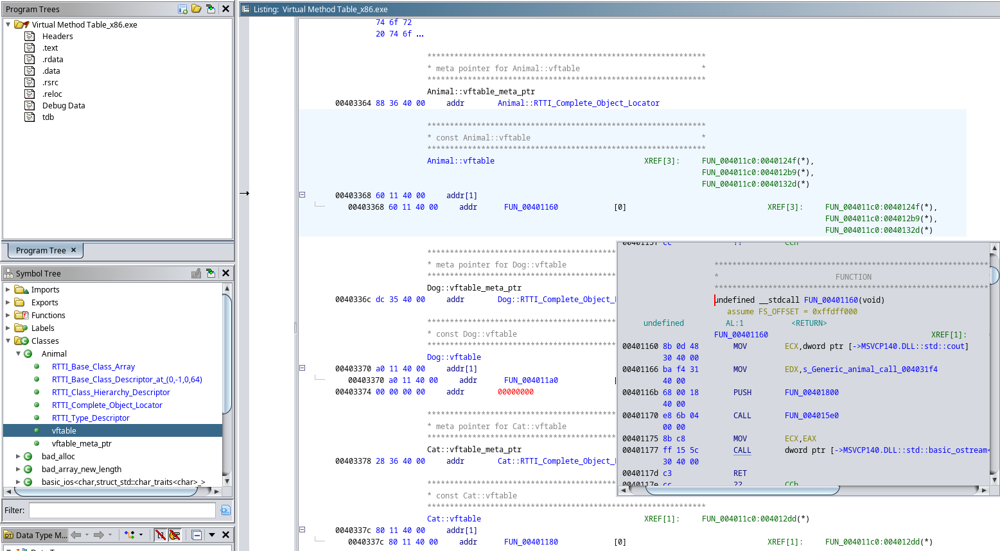
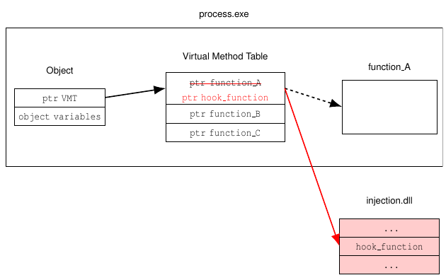
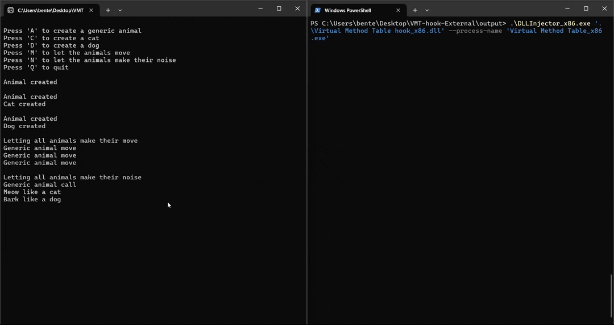
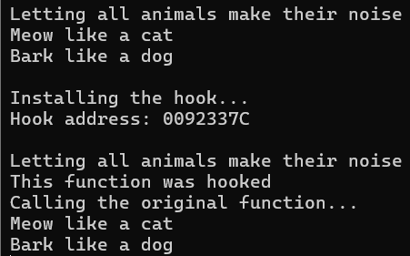

# Virtual Method Table (VMT) hook with external target

This repository contains 2 Visual Studio projects.
The target project builds a simple application that uses a Virtual Method Table (VMT).
The hook project builds a DLL that can be injected in the target to install a VMT hook.

## Virtual functions

In C++ object-oriented programming with inheritance, we can use a pointer to an object of the base class to refer to an object of a derived class.
If we use that pointer to call a regular function, the function of the base class will be executed.
If we however use the same pointer to call a virtual function, the function of the derived class will be executed instead.
Virtual functions make it possible to have a list of pointers to base objects, but still execute different functions depending on the derived class of the objects.

To implement this behaviour, the C++ compiler creates a VMT for each class with at least 1 virtual function.
This table will contain pointers to the implementations of the virtual functions for that class.

## VMT hook

We can overwrite the function pointers in the VMT of a class to point to a different hook function instead.

The target program in this repository contains a `Cat` and `Dog` class that are derived from the `Animal` class.
Each class contains 2 functions: 1 regular function and 1 virtual function.
The VMT will only contain a function pointer to the virtual function.

To find the memory address to overwrite, we can analyze the target process to find the location of the VMT.
We can do this with a decompiler like [Ghidra](https://github.com/NationalSecurityAgency/ghidra):



Here we find that the VMT of the `Cat` contains 1 function pointer located at offset `0x337c` in the x86 version of the target. For the x64 version, the function pointer is located at `0x35a8`.

To install the VMT hook, we will first inject the hook DLL in this project using a [DLL injector](https://github.com/BenteVE/DLL-Injector).
This DLL contains a hook function and an installation function.

The installation function will overwrite the function pointers in the VMT to point to the hook function in the DLL:



The hook function will simply print some text to indicate that the hook is active, before calling the original function.

## Demo

1. Clone the repository:

    ```bash
    git clone https://github.com/BenteVE/VMT-hook-External.git
    ```

2. Build the target program and hook DLL for the desired architecture (x86 or x64) using Visual Studio.
   The architecture of the DLL should match the architecture of the target program and the used DLL injector.

3. Run the target and use a DLL injector to inject the hook DLL into the target process.
   The injector used here is available in another [repository](https://github.com/BenteVE/DLL-Injector) with a detailed explanation.

4. Create some objects and verify that the hook is installed correctly.

    

    The hook is only installed for the `Cat` objects and for the virtual function `make_noise`.
    This means that the hook will not trigger for `Dog` and `Animal` objects.

    
